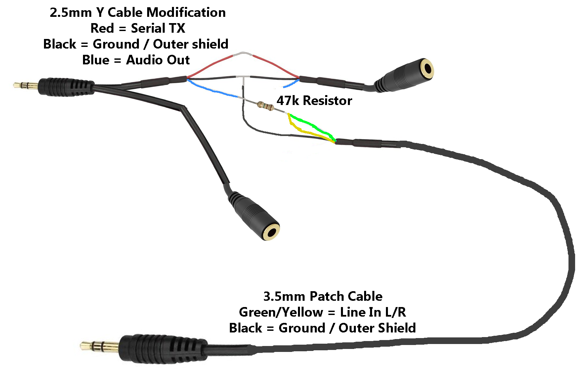

# **Quansheng Dock** V 0.28.1q
- Requires firmware 0.28.1q XVFO will not function without it.

A WPF Windows app that allows remote operation of the Quansheng UV-K5 (and equivalent) hand-held radios via the programming cable.
- If upgrading from a version before 0.27.3q the new version will likely have HUGE text on the LCD screen. This is because I had to change the way the "F Stretch" feature worked. If this happens open up your settings and change "F Stretch" to a value around 0.20

**WARNING** :
**After some unfortunate incidents by users I'm going to put this warning and disclaimer up. DO NOT attempt to transmit without the proper precautions in place. Transmitting 5W of RF energy centimetres away from a PC can LITERALLY destroy it, it's almost like an EMP at that distance. Get your antenna away from the PC.**

**Features** 
- Hardware level VFO (experimental, RX only)
- Enhanced LCD display cloning. Font and color selection.
- Channel Editor with ability to adjust multiple channels simultaneously.
- RepeaterBook Integration.
- Spectrum Analyzer with monitor mode.
- Waterfall display.
- Audio passthrough.

**Recent Changes**
- XVFO Preview. Only working in RX currently.
- Experimental TX Guard. Hopefully stops TX getting jammed on.
- US RepeaterBook support added
- Window Always On Top option added.
- Hopefully fixed some channel editor crashes.
- RepeaterBook integration.
- Channel Editor Copy/Paste functions added.
- Channel Editor cell editing improved.
- Audio Latency and Buffering options added to settings.
- (firmware) Added "Remote" option to radio menu to allow CHIRP to function.
- Fixed an issue with status data packet lengths.
- Some font rendering problems hopefully addressed.

**Download**
: A pre-compiled release is available here
https://github.com/nicsure/QuanshengDock/releases/download/0.28.1q/quanshengdock.zip

**Installation**
: The app is essentially portable and can be placed anywhere. If installing from the release build, just unzip it to a location of your choice and run the "QuanshengDock.exe" inside the folder.
You will also need to program the radio with the accompanying firmware found here : https://github.com/nicsure/quansheng-dock-fw

**Demonstration**
: You can find a demo video here: https://www.youtube.com/watch?v=UwTz5wricmY

**Hardware Requirements**
: The app will work with just the programming cable but you won't be able to hear the radio's audio as the programming cable cuts out the main speaker. You also won't be able to properly transmit as it cuts out the radio's microphone too. So to transmit voice you'll need an external microphone also.
In order to hear the audio you'll need to make a simple wiring harness. I made mine from 2.5mm/3.5mm stereo Y cable adapters, a 47k resistor and a 3.5mm stereo patch cable.
- Cut one of the tails of the 2.5mm adapter in half and isolate the inner conductors on both sides, there will be three, An outer shield which is ground, and two wires, one of which carries the audio and the other carries the serial TX.
- Determine which of these is the audio. It is the wire connecting to the tip (end) of the 2.5mm jack plug, you can use a multi-meter in continuity mode to do this.
- Cut back and isolate the audio wire on the tail side (non radio side) as this is not used.
- On the radio side connect a 47k resistor to the audio wire.
- Cut off one of the ends of the patch cable and isolate the inner conductors, there will be three, an outer shield for ground and two inner wires which carry the left and right audio channels.
- Connect the inner wires together and then connect this combined wire to the other side of the resistor.
- Connect both sides of the tail grounds (outer shield) back together and connect those to the patch cable's outer shield.
- Connect the tail's TX data lines back together.

You may be wondering why you can't just use an external speaker, the reason is because the audio needs to be converted to high-impedance to prevent the audio bleeding over the serial data. If you just connect a low impedance speaker (like in a speaker microphone) and the programming cable using the Y adapters, when there's any audio from the radio, the serial line gets flooded with garbage data.

**Hardware Configuration**
: As previously mentioned you can just use a programming cable alone without any audio, but if you're using the wiring harness
- plug the programming cable's 3.5mm jack into either of the 3.5mm Y cable's tails.
- The programming cable's 2.5mm jack should be plugged into the **UNMODIFIED** tail of the 2.5mm Y adapter.
- The microphone's 2.5mm jack should be plugged into the **MODIFIED** tail.
- Plug the microphone's 3.5mm jack into the remaining tail.
- Plug both Y adapter's jacks into the radio.
- Connect the 3.5mm patch lead to your PC's line input or you may use any device that can accept audio line input.

